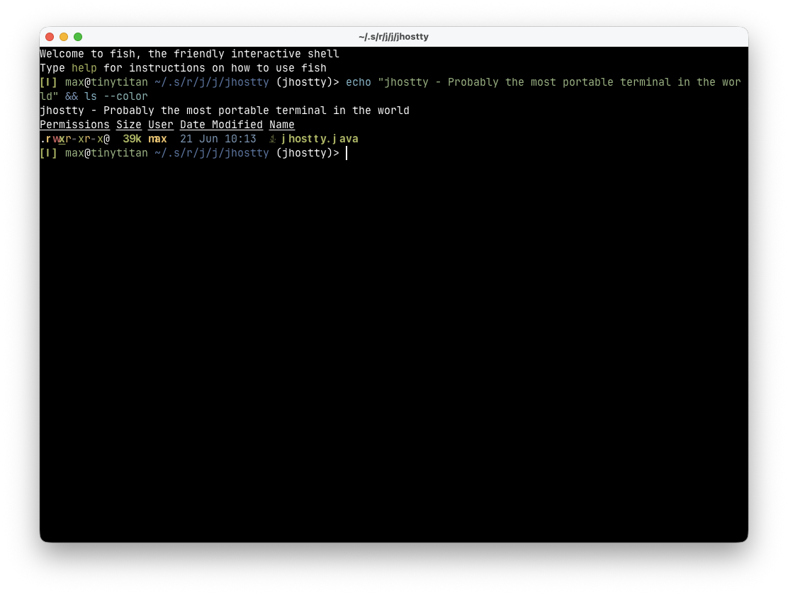
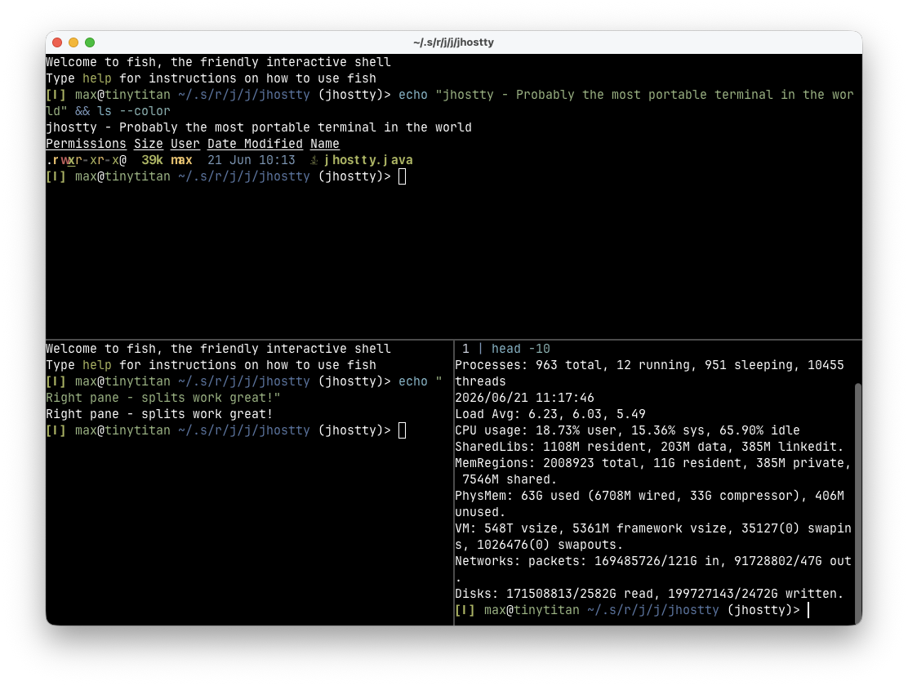
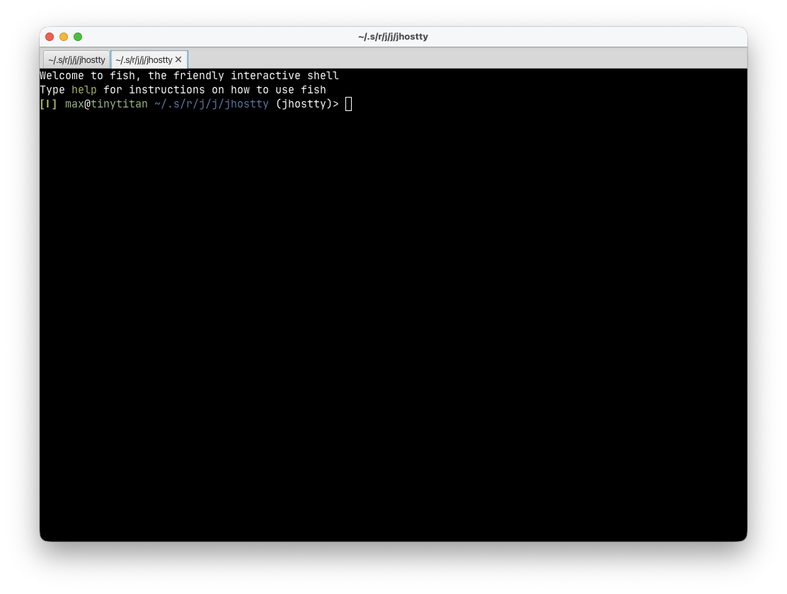
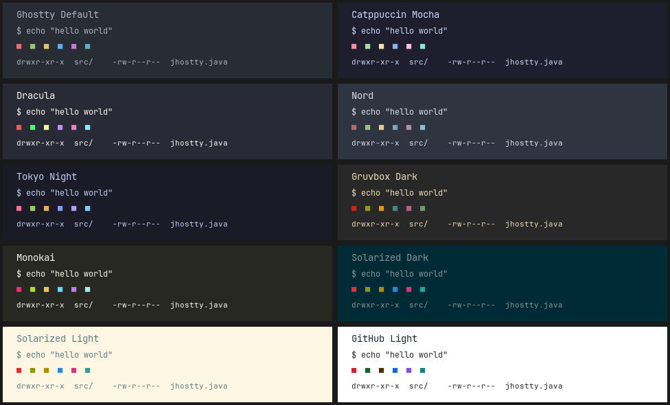
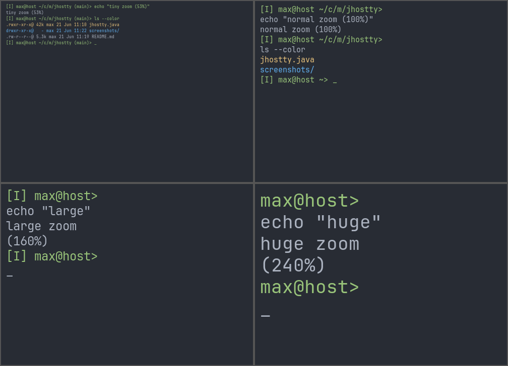

<p align="center">
  
</p>
<p align="center">
  <em>Probably the most portable terminal in the world</em>
</p>

<p align="center">
  
  
  
  
</p>

A full-featured terminal emulator in a **single Java file**, powered by [GhosttyFX](https://github.com/vlaaad/ghosttyfx) — Ghostty's terminal engine exposed as a JavaFX control. No build system, no IDE, no project setup — just [JBang](https://jbang.dev) and one file.



This was an idea created, edited and published in a few hours a Sunday morning - no promises; but do share if it works or not for you :)

## Get Started

**Run instantly** (JBang downloads Java 25 automatically if needed):

```bash
jbang jhostty@maxandersen
```

**Install as a command** for everyday use:

```bash
jbang app install jhostty@maxandersen
jhostty
```

Or clone and run from source:

```bash
git clone https://github.com/maxandersen/jhostty.git
cd jhostty
jbang jhostty.java
```

## Features

### 🪟 Multiple Windows, Tabs & Splits

Open as many windows, tabs, and split panes as you need. Horizontal and vertical splits can be nested freely.



Tab bar appears automatically when you have more than one tab, hides when you're back to one.



### 🎨 10 Built-in Themes

Switch themes on the fly from the View menu — the entire UI adapts, including context menus and split dividers.



### 🔍 Per-Terminal Zoom

Each split pane has its own independent zoom level. Zoom with keyboard shortcuts, scroll wheel, or trackpad pinch (macOS). The title bar shows the current zoom percentage.



### 🔤 All System Fonts

Every font on your system is available in the View → Font menu. Popular terminal fonts (JetBrains Mono, Fira Code, Hack, SF Mono, Consolas) are listed first for quick access.

### ✨ More

- **Drag-and-drop** — drop files, text, or URLs onto any terminal pane
- **Link detection** — clickable URLs in terminal output
- **Right-click context menu** — styled to match the current theme
- **Shell integration** — search (⌘F/Ctrl+F) and prompt navigation via Ghostty shell integration
- **Native macOS menu bar** — app name, menus, and shortcuts feel native
- **Cross-platform shortcuts** — ⌘ on macOS, Ctrl on Windows/Linux

## Keyboard Shortcuts

| Action | macOS | Windows / Linux |
|--------|-------|-----------------|
| New Window | ⌘N | Ctrl+N |
| New Tab | ⌘T | Ctrl+T |
| Split Horizontal | ⌘D | Ctrl+D |
| Split Vertical | ⌘⇧D | Ctrl+Shift+D |
| Close Terminal | ⌘W | Ctrl+W |
| Zoom In | ⌘+ | Ctrl++ |
| Zoom Out | ⌘− | Ctrl+− |
| Reset Zoom | ⌘0 | Ctrl+0 |
| Search | ⌘F | Ctrl+F |
| Scroll Zoom | ⌘+scroll | Ctrl+scroll |

## Requirements

- [JBang](https://jbang.dev) — that's it. JBang handles everything else:
  - Downloads **Java 25** automatically if not present
  - Resolves **GhosttyFX**, **pty4j**, and all dependencies
  - Compiles and caches the single `.java` file

## How It Works

jhostty is a single `jhostty.java` file — ~940 lines, no build system, no project structure. JBang reads the dependency declarations at the top of the file, resolves everything from Maven Central, and runs it.

```
jhostty.java
├── Terminal rendering ← GhosttyFX (Ghostty's engine in JavaFX)
├── PTY backend       ← pty4j (cross-platform pseudo-terminal)
├── UI                ← JavaFX (comes with GhosttyFX)
└── Build/run         ← JBang (zero setup)
```

Key design choices:
- **No `Application` subclass ceremony** — uses `Application.launch()` with a minimal `start()` method
- **All state is static** — single-file simplicity, no DI framework
- **Per-terminal zoom** via node properties — no global state conflicts
- **Event filters** intercept shortcuts before the terminal view consumes them
- **Dynamic CSS** — theme changes regenerate a temp CSS file and hot-reload it

## Configuration

jhostty automatically saves your preferences (theme, font, zoom, window position) to:

```
~/.config/jhostty/jhostty-state.properties
```

This file is auto-managed — changes you make in the app are saved on exit. To customize settings permanently, create your own override file:

```
~/.config/jhostty/jhostty.properties
```

User config takes priority over saved state. Omit a key or leave it blank to auto-detect / use the default.

### Available settings

| Key | Description | Default |
|-----|-------------|---------|
| `theme` | Theme name (e.g. `Dracula`, `Nord`, `Catppuccin Mocha`) | Ghostty Default |
| `font` | Font family (e.g. `JetBrains Mono`) | Auto-detected |
| `font-size` | Base font size in points — what "Reset Zoom" returns to | `15.0` |
| `zoom` | Current zoom level in points — remembered across restarts | Same as `font-size` |
| `shell` | Shell command (e.g. `/bin/zsh`) | Auto-detected |
| `window-x` | Window X position in pixels | OS default |
| `window-y` | Window Y position in pixels | OS default |

### Example

```properties
# ~/.config/jhostty/jhostty.properties
theme=Dracula
font=JetBrains Mono
font-size=16.0
```

Use **View → Reload Config** to apply changes without restarting.

### Pkl config (optional)

If you'd rather write config as typed, validated [Apple Pkl](https://pkl-lang.org), create:

```
~/.config/jhostty/jhostty.pkl
```

```pkl
// ~/.config/jhostty/jhostty.pkl
theme = "Dracula"
font = "JetBrains Mono"
["font-size"] = 16.0
```

jhostty has no Pkl library dependency — when `jhostty.pkl` is present it shells out to the
[`pkl` CLI](https://pkl-lang.org/main/current/pkl-cli/index.html) (`pkl eval -f properties`) to
render it to Java properties, so you need `pkl` installed and on your `PATH` for this file to take
effect. If it isn't found, jhostty logs a warning and falls back to `jhostty.properties` / saved
state. When present, `jhostty.pkl` takes priority over both.

## Font Recommendation

For the best experience with nerd font glyphs (powerline symbols, git icons):

```bash
# macOS
brew install font-jetbrains-mono-nerd-font

# Linux
sudo apt install fonts-jetbrains-mono  # or your distro's equivalent

# Windows
# Download from https://www.nerdfonts.com/font-downloads
```

## Debugging

Run with `--debug` to log input events and modifiers to stderr:

```bash
jbang jhostty@maxandersen --debug
```

## Built With

| Component | What | Why |
|-----------|------|-----|
| [GhosttyFX](https://github.com/vlaaad/ghosttyfx) | Terminal control | Ghostty's rendering engine as a JavaFX node |
| [pty4j](https://github.com/JetBrains/pty4j) | PTY backend | Cross-platform pseudo-terminal from JetBrains |
| [JBang](https://jbang.dev) | Build & run | Zero-setup Java scripting — no Maven, no Gradle |
| [JavaFX](https://openjfx.io) | UI toolkit | Comes transitively via GhosttyFX |

## License

MIT
