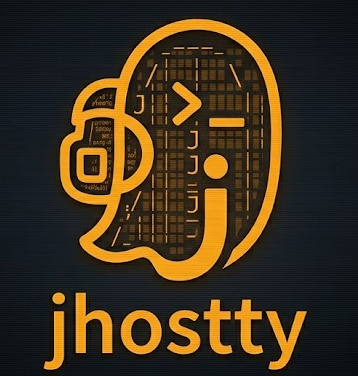

<p align="center">
  
</p>
<p align="center">
  <em>Probably the most portable terminal in the world</em>
</p>

<p align="center">
  
  
  
  
</p>

A terminal emulator powered by [GhosttyFX](https://github.com/vlaaad/ghosttyfx) — Ghostty's terminal engine exposed as a JavaFX control. No build system, no IDE, no project setup — just [JBang](https://jbang.dev).

jhostty [started as a single ~940-line Java file](https://github.com/maxandersen/jhostty/commit/38c3c2a) hacked together on a Sunday morning and has since evolved into a more full-featured terminal with tiling splits, 1365 themes, a command palette, tab management, and more — while still running with a simple `jbang` command.

## Get Started

**Run instantly** (JBang downloads Java 25 automatically if needed):

```bash
jbang https://github.com/maxandersen/jhostty/blob/combined/jhostty.java
```

Or clone and run from source:

```bash
git clone https://github.com/maxandersen/jhostty.git
cd jhostty
git checkout combined
jbang jhostty.java
```

## Features

### 🪟 Tiling Split Panes

A custom tiling workspace (inspired by [Mitchell Hashimoto's SuperSplit](https://mitchellh.com/writing/ghostty-is-1.0#supersplit)) with recursive horizontal/vertical splits, weighted sizing, animated reflow, pane zoom, and drag & drop reorder.

- **Add Column** (⌘D) / **Add Row** (⌘⇧D) to split
- **Drag pane headers** to swap or reorder
- **Drag a pane outside** the window to create a new window
- **Double-click header** to zoom/unzoom a pane
- **Hold ⌘** to see pane numbers, press 1–9 to jump
- **⌘⇧Enter** to toggle pane zoom
- **⌘⇧←↑→↓** to resize the focused pane
- **Divider drag** including corner drag at junctions (both axes)

### 📑 Tabs

- **⌘T** new tab (inserts after current)
- **⌘⇧T** show all tabs — grid overview with snapshots and smooth zoom animation
- **Drag tabs** to reorder
- **+** button on each tab (visible on hover) to add adjacent tab
- **Close Other Tabs**, **Close Tabs to Left/Right** via command palette

### 🎯 Command Palette (⌘P)

VS Code-style command palette with fuzzy search across all commands, tabs, and 1365 themes. Arrow keys to navigate, Enter to execute.

### 🎨 1365 Themes

Bundled themes sourced from iTerm2-Color-Schemes, Gogh, and more. Browse and apply instantly via the Settings panel (searchable list with color previews) or the command palette.

### 📊 Settings Panel (⌘,)

Live-adjustable settings: theme selector, zoom, pastel opacity, gutter width, corner radius, header height, focus ring, animation speed, and toggles for pastel tinting, animations, and focus-follows-mouse.

### 🔒 Read-Only Mode

Toggle via command palette or right-click. Blocks keyboard input while allowing scrolling, selection, and copy. Shows an orange "READ-ONLY" pill badge.

### 📂 Sidebar (⌘/)

Tree view of all windows, tabs, and terminals. Shows zmx session integration with attach support. Click to navigate, double-click to focus.

### ✨ More

- **Focus follows mouse** — enabled by default, toggle in settings
- **Pinch-to-zoom** — trackpad zoom without modifier key
- **Per-terminal zoom** with ⌘+/⌘- and scroll wheel
- **Drag-and-drop** files, text, or URLs onto any terminal
- **Layout persistence** — full split tree saved/restored across restarts
- **Native macOS title bar** with custom toolbar
- **Theme-aware UI** — tabs, scrollbars, context menus, sidebar, and settings all adapt
- **zmx session** integration
- **Help** (⌘⇧/) — ANSI-styled reference in a terminal tab

## Keyboard Shortcuts

| Action | macOS | Windows / Linux |
|--------|-------|-----------------|
| Command Palette | ⌘P | Ctrl+P |
| New Tab | ⌘T | Ctrl+T |
| Show All Tabs | ⌘⇧T | Ctrl+Shift+T |
| New Window | ⌘N | Ctrl+N |
| Add Column | ⌘D | Ctrl+D |
| Add Row | ⌘⇧D | Ctrl+Shift+D |
| Close Pane/Tab | ⌘W | Ctrl+W |
| Zoom In / Out | ⌘+ / ⌘- | Ctrl++ / Ctrl+- |
| Reset Zoom | ⌘0 | Ctrl+0 |
| Zoom/Unzoom Pane | ⌘⇧Enter | Ctrl+Shift+Enter |
| Focus Pane 1–9 | ⌘1–⌘9 | Ctrl+1–9 |
| Focus Next Pane | ⌘Tab | Ctrl+Tab |
| Resize Pane | ⌘⇧↑↓←→ | Ctrl+Shift+↑↓←→ |
| Toggle Sidebar | ⌘/ | Ctrl+/ |
| Toggle Settings | ⌘, | Ctrl+, |
| Help | ⌘⇧/ | Ctrl+Shift+/ |
| Quit | ⌘Q | Ctrl+Q |

## Configuration

Preferences (theme, font, zoom, layout, window position) are auto-saved to:

```
~/.config/jhostty/jhostty-state.properties
```

Create a user override file for permanent settings:

```
~/.config/jhostty/jhostty.properties
```

### Available settings

| Key | Description | Default |
|-----|-------------|---------|
| `theme` | Theme name (e.g. `Dracula`, `Nord`, `Catppuccin Mocha`) | Ghostty Default |
| `font` | Font family (e.g. `JetBrains Mono`) | Auto-detected |
| `font-size` | Base font size in points | `15.0` |
| `zoom` | Current zoom level | Same as `font-size` |
| `shell` | Shell command (e.g. `/bin/zsh`) | Auto-detected |
| `sidebar` | Show sidebar on startup | `false` |
| `layout` | Split tree layout (auto-saved) | — |

### Example

```properties
# ~/.config/jhostty/jhostty.properties
theme=Dracula
font=JetBrains Mono
font-size=16.0
```

Use **View → Reload Config** or the command palette to apply changes without restarting.

## Architecture

jhostty started as a single `jhostty.java` file and has grown into a modular structure, still runnable with just `jbang`:

```
jhostty.java                          ← Entry point (thin launcher)
src/dk/xam/jhostty/
├── JHostty.java                      ← Main app (~2600 lines)
├── SplitWorkspace.java               ← Tiling split pane engine (~1800 lines)
├── Themes.java                       ← Bridge to 1365 bundled themes
├── FontManager.java                  ← Font detection
├── ShellDetection.java               ← Shell auto-detection
├── PtyTerminal.java                  ← PTY process wrapper
├── LayoutCodec.java                  ← Layout serialization (T/C/R format)
├── MacUtils.java                     ← macOS app name via FFI
└── ZmxSession.java                   ← zmx session integration
src/dk/xam/themes/
├── ThemeRegistry.java                ← Theme loading from bundled JSON
├── TerminalColorScheme.java          ← Color scheme model
└── ColorUtil.java                    ← Color parsing utilities
themes/
└── builtin-themes.json               ← 1365 bundled color schemes
```

## Built With

| Component | What | Why |
|-----------|------|-----|
| [GhosttyFX](https://github.com/vlaaad/ghosttyfx) | Terminal control | Ghostty's rendering engine as a JavaFX node |
| [pty4j](https://github.com/JetBrains/pty4j) | PTY backend | Cross-platform pseudo-terminal from JetBrains |
| [JBang](https://jbang.dev) | Build & run | Zero-setup Java scripting |
| [JavaFX](https://openjfx.io) | UI toolkit | Comes transitively via GhosttyFX |

## Ghostly — iOS sibling

[`ios/`](ios/) contains **Ghostly**, an iOS app in the jhostty family: a SwiftUI
SSH terminal that is **[zmx](https://zmx.sh) session-aware**. It SSHes into your
machines, opens a terminal (SwiftTerm rendering, swift-nio-ssh transport), and on
connect detects persistent zmx sessions so you can re-attach after a dropped
connection. It reuses jhostty's Ghostty theme format and its `ZmxSession`
parsing. See [ios/README.md](ios/README.md).

## License

MIT
